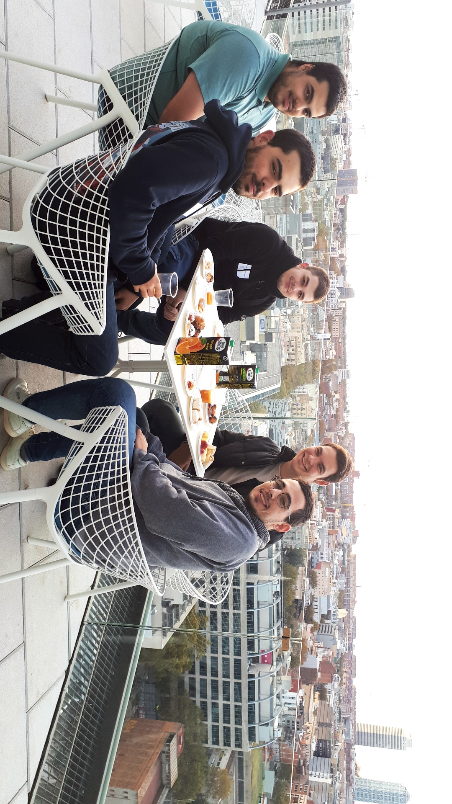

## **Our project** 

This project has been done by five catalan students of CITM - UPC (Terrasa, Spain).

## **Our Team**

_Masó Garcia, Víctor's responsability and Github account_

* Artist
* [Github account](https://github.com/nintervik)

...

___
## **Tools used**
___

* IDE: Microsoft Visual Studio 
* Language: C#
* Engine: Unity 3D
* Art: Photoshop

___
## **Gameplay**
___

___
## **Installation instructions**

Download the zip file and unzip it. Open the folder, execute the .exe and enjoy!

_IMPORTANT: do not modify, change or add any folder or file as you might not be able to execute the game._
___

## **How to play**

### Controls
~~~~~~~~~~~~~~~

Player controls:
- JUMP: W key (twice for double jump)
- LEFT: A key
- RIGHT: D key
- SHOOT: SPACE key (hold for continuous shooting)

~~~~~~~~~~~~~~~

___

> ### *Download the last version of the game [HERE](https://github.com/nintervik/Temple-Escape/releases/tag/v1.0)*
> ### *Check our Github repository [HERE](https://github.com/nintervik/Temple-Escape)*

***
***

## **License**

~~~~~~~~~~~~~~~

MIT License

Copyright (c) 2017 

Permission is hereby granted, free of charge, to any person obtaining a copy
of this software and associated documentation files (the "Software"), to deal
in the Software without restriction, including without limitation the rights
to use, copy, modify, merge, publish, distribute, sublicense, and/or sell
copies of the Software, and to permit persons to whom the Software is
furnished to do so, subject to the following conditions:

The above copyright notice and this permission notice shall be included in all
copies or substantial portions of the Software.

THE SOFTWARE IS PROVIDED "AS IS", WITHOUT WARRANTY OF ANY KIND, EXPRESS OR
IMPLIED, INCLUDING BUT NOT LIMITED TO THE WARRANTIES OF MERCHANTABILITY,
FITNESS FOR A PARTICULAR PURPOSE AND NONINFRINGEMENT. IN NO EVENT SHALL THE
AUTHORS OR COPYRIGHT HOLDERS BE LIABLE FOR ANY CLAIM, DAMAGES OR OTHER
LIABILITY, WHETHER IN AN ACTION OF CONTRACT, TORT OR OTHERWISE, ARISING FROM,
OUT OF OR IN CONNECTION WITH THE SOFTWARE OR THE USE OR OTHER DEALINGS IN THE
SOFTWARE.

~~~~~~~~~~~~~~~
